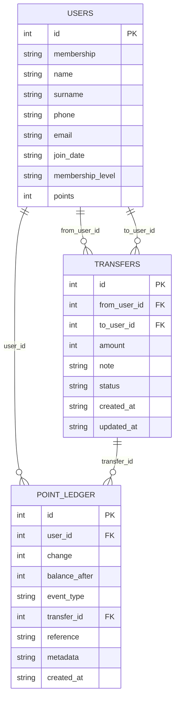

# Database Schema

```mermaid
erDiagram
    USERS {
        int id PK
        string membership
        string name
        string surname
        string phone
        string email
        string join_date
        string membership_level
        int points
    }

    TRANSFERS {
        int id PK
        int from_user_id FK
        int to_user_id FK
        int amount
        string note
        string status
        string created_at
        string updated_at
    }

    POINT_LEDGER {
        int id PK
        int user_id FK
        int change
        int balance_after
        string event_type
        int transfer_id FK
        string reference
        string metadata
        string created_at
    }

    USERS ||--o{ TRANSFERS : "from_user_id"
    USERS ||--o{ TRANSFERS : "to_user_id"
    USERS ||--o{ POINT_LEDGER : "user_id"
    TRANSFERS ||--o{ POINT_LEDGER : "transfer_id"
```
